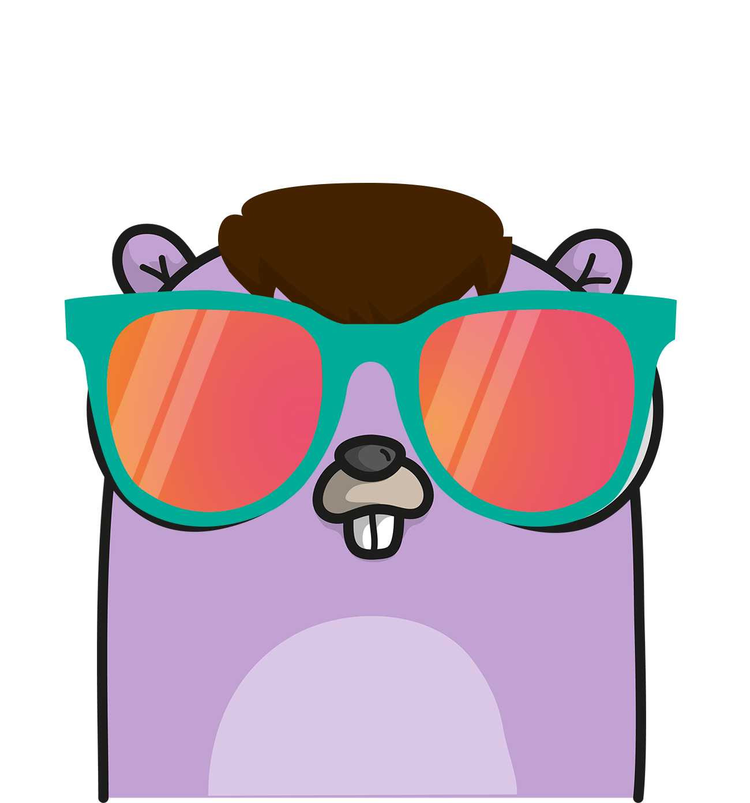

<!-- Improved compatibility of back to top link: See: https://github.com/RealAlexandreAI/gen-ui-go/pull/73 -->
<a name="readme-top"></a>
<!--
*** Thanks for checking out the Best-README-Template. If you have a suggestion
*** that would make this better, please fork the repo and create a pull request
*** or simply open an issue with the tag "enhancement".
*** Don't forget to give the project a star!
*** Thanks again! Now go create something AMAZING! :D
-->


<!-- PROJECT SHIELDS -->
<!--
*** I'm using markdown "reference style" links for readability.
*** Reference links are enclosed in brackets [ ] instead of parentheses ( ).
*** See the bottom of this document for the declaration of the reference variables
*** for contributors-url, forks-url, etc. This is an optional, concise syntax you may use.
*** https://www.markdownguide.org/basic-syntax/#reference-style-links
-->
[![Contributors][contributors-shield]][contributors-url]
[![Forks][forks-shield]][forks-url]
[![Stargazers][stars-shield]][stars-url]
[![Issues][issues-shield]][issues-url]
[![GPL License][license-shield]][license-url]


<!-- PROJECT LOGO -->
<br />
<div align="center">
  <a href="https://github.com/RealAlexandreAI/gen-ui-go">
    
  </a>

<h3 align="center">gen-ui-go</h3>

  <p align="center">
    Generative UI in Golang, based on HTMX and Templ, is useful in Multi-Agent Systems.
    <br />
    <a href="https://github.com/RealAlexandreAI/gen-ui-go/issues/new?labels=bug&template=bug-report---.md">Report Bug</a>
    ·
    <a href="https://github.com/RealAlexandreAI/gen-ui-go/issues/new?labels=enhancement&template=feature-request---.md">Request Feature</a>
  </p>
</div>


<!-- ABOUT THE PROJECT -->
## 🖌Generative UI in Golang, based on HTMX and Templ, is useful in Multi-Agent Systems.

### 🌟 Reasons to Choose gen-ui-go

🌐 Continuously Updated UI Component Library: Our UI component library is constantly expanding, offering the latest design elements and features to help developers keep their applications modern while maintaining high performance and elegance.

🖥️ Full Backend Rendering: gen-ui-go implements full backend rendering, ensuring data security and privacy. This makes it particularly suitable for scenarios that require a high degree of data control and customized rendering logic.

🤖 Multi-Agent Planning Support: gen-ui-go supports multi-agent systems, allowing different agents to participate in UI planning and decision-making processes, providing robust support for complex interactions and automated workflows.

🔄 Interactivity in Semi-Automatic Workflows: In semi-automatic workflows, gen-ui-go offers the capability for real-time interaction, allowing users to dynamically adjust and optimize during the running process, thereby improving efficiency and responsiveness.

🔧 Suitable for Dynamic Environments: Whether it's a fast-paced agile development environment or a finely controlled production environment, gen-ui-go provides the tools and flexibility needed to adapt to various development requirements.

### Intro

## Updates 

### Timeline
### Card
### Conversation
### Button
### List
### Textarea


<!-- GETTING STARTED -->
## 🏁 Getting Started
To add the gen-ui-go to your Go project, use the following command:

```
// TODO Register here

```

<!-- ROADMAP -->
## Roadmap

- [x] Basic feature
- [ ] Modern CSS like bulma
- [ ] Registry like otel collector
- [ ] More components


See the [open issues](https://github.com/RealAlexandreAI/gen-ui-go/issues) for a full list of proposed features (and known issues).

<p align="right">(<a href="#readme-top">back to top</a>)</p>


<!-- CONTRIBUTING -->
## Contributing

Contributions are what make the open source community such an amazing place to learn, inspire, and create. Any contributions you make are **greatly appreciated**.

If you have a suggestion that would make this better, please fork the repo and create a pull request. You can also simply open an issue with the tag "enhancement".
Don't forget to give the project a star! Thanks again!

1. Fork the Project
2. Create your Feature Branch (`git checkout -b feature/AmazingFeature`)
3. Commit your Changes (`git commit -m 'Add some AmazingFeature'`)
4. Push to the Branch (`git push origin feature/AmazingFeature`)
5. Open a Pull Request

<p align="right">(<a href="#readme-top">back to top</a>)</p>

<!-- LICENSE -->
## License

Distributed under the GPLv3 License. See `LICENSE` for more information.

<p align="right">(<a href="#readme-top">back to top</a>)</p>


<!-- CONTACT -->
## Contact

RealAlexandreAI - [@RealAlexandreAI](https://twitter.com/RealAlexandreAI)

Project Link: [https://github.com/RealAlexandreAI/gen-ui-go](https://github.com/RealAlexandreAI/gen-ui-go)

<p align="right">(<a href="#readme-top">back to top</a>)</p>


<!-- MARKDOWN LINKS & IMAGES -->
<!-- https://www.markdownguide.org/basic-syntax/#reference-style-links -->
[contributors-shield]: https://img.shields.io/github/contributors/RealAlexandreAI/gen-ui-go.svg?style=for-the-badge
[contributors-url]: https://github.com/RealAlexandreAI/gen-ui-go/graphs/contributors
[forks-shield]: https://img.shields.io/github/forks/RealAlexandreAI/gen-ui-go.svg?style=for-the-badge
[forks-url]: https://github.com/RealAlexandreAI/gen-ui-go/network/members
[stars-shield]: https://img.shields.io/github/stars/RealAlexandreAI/gen-ui-go.svg?style=for-the-badge
[stars-url]: https://github.com/RealAlexandreAI/gen-ui-go/stargazers
[issues-shield]: https://img.shields.io/github/issues/RealAlexandreAI/gen-ui-go.svg?style=for-the-badge
[issues-url]: https://github.com/RealAlexandreAI/gen-ui-go/issues
[license-shield]: https://img.shields.io/github/license/RealAlexandreAI/gen-ui-go.svg?style=for-the-badge
[license-url]: https://github.com/RealAlexandreAI/gen-ui-go/blob/master/LICENSE
[product-screenshot]: images/screenshot.png


